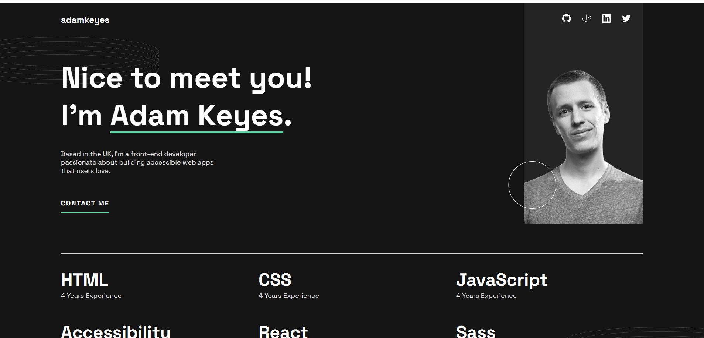

<p align="right">
  <a href="./README.md">🇺🇸 English</a> | 🇪🇸 Español
</p>

<h1 align="center">💼 Portfolio Personal</h1>

<p align="center">
Proyecto frontend desarrollado para crear un portfolio moderno y responsive donde mostrar proyectos, habilidades técnicas y aplicar buenas prácticas de desarrollo frontend utilizando herramientas modernas y una arquitectura escalable.
</p>

<p align="center">
Construido con HTML5, SCSS, JavaScript y Vite
</p>

<p align="center">

<a href="https://edgarmadrid.github.io/Portfolio/">

</a>

</p>

---

<p align="center">


</p>

---

## 🔗 Demo

<p align="center">
<a href="https://edgarmadrid.github.io/Portfolio/">
Ver demo en vivo →
</a>
</p>

---

# ✨ Sobre el proyecto

**Portfolio Personal** es un proyecto frontend desarrollado para crear un sitio web portfolio moderno y responsive donde presentar proyectos, habilidades técnicas e información profesional.

El proyecto fue creado a partir de un diseño en Figma, aplicando buenas prácticas profesionales de desarrollo frontend enfocadas en la escalabilidad, mantenibilidad y escritura de código limpio.

El objetivo principal no fue únicamente reproducir el diseño visual, sino también implementar una arquitectura frontend organizada similar a la utilizada en proyectos reales.

---

# 🧩 Conceptos aplicados

Durante el desarrollo se implementaron los siguientes conceptos:

✅ Estructura HTML5 semántica  
✅ Arquitectura basada en componentes  
✅ Arquitectura SCSS siguiendo el patrón **7-1**  
✅ Variables SCSS y gestión centralizada de configuración  
✅ Mixins reutilizables  
✅ Funciones y fórmulas SCSS para valores dinámicos  
✅ Metodología BEM para nomenclatura CSS  
✅ Flujo de trabajo Mobile First  
✅ Diseño responsive mediante media queries  
✅ Optimización e integración de recursos SVG  
✅ Estados hover e interacciones  
✅ Flujo de desarrollo con Vite  

---

# 🎯 Objetivo

Crear un portfolio profesional responsive aplicando estándares modernos de frontend y estableciendo una base escalable para futuros proyectos.

### Objetivos principales:

- Crear una arquitectura limpia y mantenible
- Aplicar buenas prácticas de SCSS escalable
- Construir componentes UI reutilizables
- Desarrollar layouts con enfoque Mobile First
- Implementar comportamiento responsive
- Mejorar la organización del CSS
- Crear una presentación profesional como desarrollador

---

# 🚀 Tecnologías

<div align="center">

| Tecnología | Uso |
|------------|---------|
| 🌐 HTML5 | Estructura semántica |
| 🎨 SCSS | Arquitectura avanzada de estilos |
| ⚡ JavaScript | Comportamiento dinámico e interacción |
| ⚡ Vite | Entorno de desarrollo y herramienta de construcción |
| 📱 Responsive Design | Enfoque Mobile First |

</div>

---

# 🎨 Características SCSS

Este proyecto utiliza técnicas avanzadas de organización con SCSS:

## Variables

Gestión centralizada de:

- Colores
- Tipografías
- Espaciados
- Breakpoints
- Configuración global


## Mixins

Estilos reutilizables para:

- Media queries
- Comportamiento responsive
- Layouts comunes


## Funciones

Cálculos dinámicos para:

- Conversión de unidades REM
- Tamaños flexibles
- Medidas consistentes


## Arquitectura 7-1

El código SCSS está organizado siguiendo una metodología escalable:

- Abstracts
- Base
- Components
- Layout
- Pages
- Themes
- Vendors

---

# 📱 Diseño Responsive

El proyecto sigue un enfoque **Mobile First**:

El desarrollo comienza desde pantallas pequeñas y se adapta progresivamente mediante media queries para:

- Dispositivos móviles
- Tablets
- Pantallas de escritorio

---

# 📷 Vista previa

<p align="center">

</p>

---

# 🛠️ Ejecutar localmente

Clonar repositorio:

```bash
git clone https://github.com/EdgarMadrid/Portfolio.git
```

Entrar al proyecto:

```bash
cd Portfolio
```

Instalar dependencias:

```bash
pnpm install
```

Ejecutar servidor de desarrollo:

```bash
pnpm run dev
```

Generar versión de producción:

```bash
pnpm run build
```

---

# 📚 Aprendizajes

Este proyecto reforzó conocimientos en:

- Arquitectura frontend profesional
- Flujos de trabajo avanzados con SCSS
- Metodología de arquitectura 7-1
- Escalabilidad CSS
- Sistemas de diseño responsive
- Desarrollo Mobile First
- Integración de componentes JavaScript
- HTML5 semántico
- Flujo de trabajo con Vite
- Buenas prácticas frontend

---

# 👨‍💻 Autor

<p align="center">

<a href="https://github.com/EdgarMadrid">

</a>

<a href="https://www.linkedin.com/in/emadrid110">

</a>

</p>

---

<p align="center">
⭐ Si te gustó este proyecto, considera darle una estrella en GitHub.
</p>
